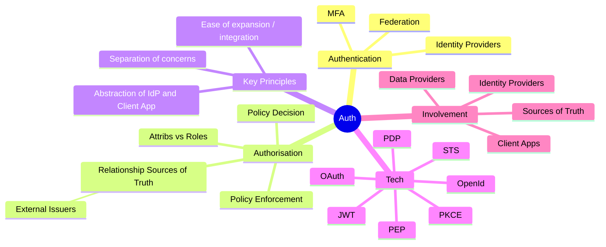
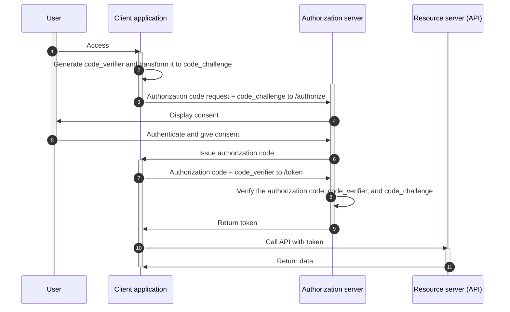
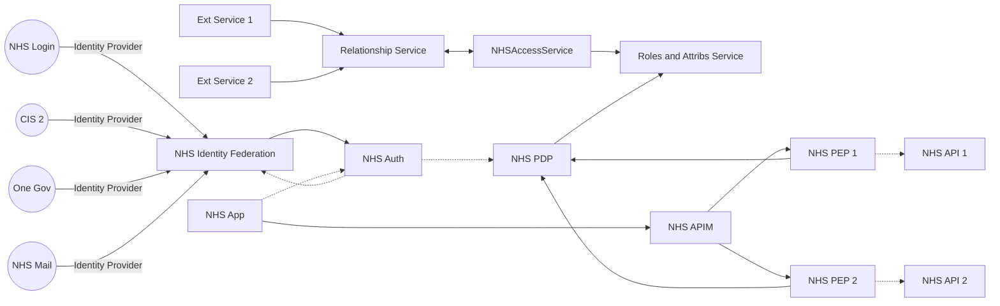
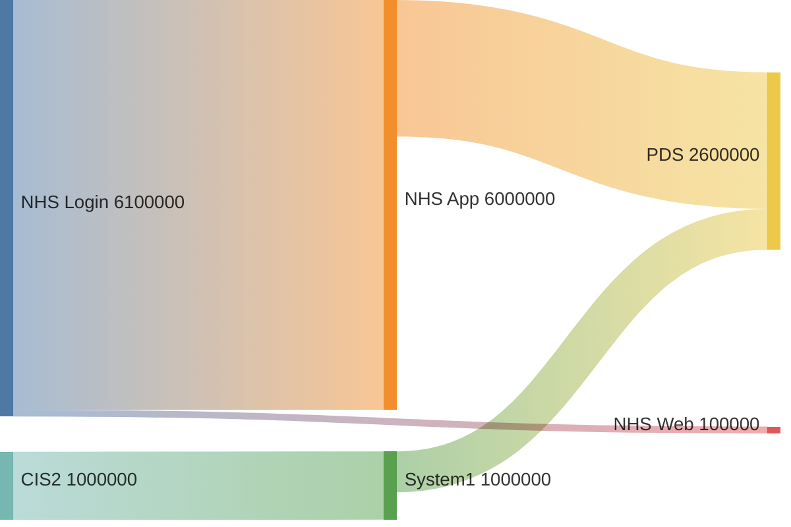

  

    Table of contents
  

  {: .text-delta }
1. TOC
{:toc}

## Notes for Author - Aims / Objectives / Direction / Plan

- Making Auth accessible to wider audience
- Deep dive sections 
- Also appeal to those with tech background
- Include a case study - how could / should be done
- Need simple diagrams / images
- Need simple example scenarios
- Need a short summary version, and then a longer version with much more detail

### Objectives

- Provide non tech staff with a understanding 
- Provide details for tech staff to find interesting and to enhance existing knowledge
- Outline architectural design for a NHS Scenario, how to best use tech? "Proxy?"
- Use dev background, provide working code examples and deployments of how this fits together is "best case" scenario

## Summary

Authentication, Authorisation, OAuth, OpenId, Enforcement, Decisions, Credentials, Claims, JWT, Grants, Flows, Bearer, Tokens, Scopes, Policies, Roles, Attributes - the list could go on. Auth is hard. It is hard at times for people with a technical background, developers, engineers and architects. It's just as hard for project managers, business analystics and product teams. 

The aim of this paper is to remove some of the magic and mystery that surrounds Auth, hoping to allow a winder audience to have a better understanding of common Auth terms and processes.

It will then take a look at how NHS could utilise these best practises and follow set Enterprise Architect standards to achieve better outcomes for citizens and staff.

### Mind map thinking

## Introduction

People today have an identity crisis. They may not know it, but most will feel it in their every day interactions with technology. 

## Authentication

### What is an Identity Provider (IdP) should an Identity Provider be doing?

## Authorisation

#### Authorization Code Flow With Proof Key of Code Exchange (PKCE)

Understanding PKCE flow [^auth-flow-pkce]

## How this could look

## Key Technologies and Processes

### OAuth

### Tokens

#### Id Token

#### Access Token

#### Refresh Token

### OpenId

### Policy Decision and Enforcement

### Claims, Roles, Attributes

### Identity Federation

## How can this be implemented successfully?

### Testing a Sankey Diagram

## References

[^auth-flow-pkce]:Authorization Code Flow With Proof Key of Code Exchange (PKCE)

    - Reference: [Authorization Code Flow With Proof Key of Code Exchange (PKCE)][auth-flow-pkce-url]
    - Type: Website
    - Last Checked: 15/08/2023

[auth-flow-pkce-url]:https://cloudentity.com/developers/basics/oauth-grant-types/authorization-code-with-pkce/ "Authorization Code Flow With Proof Key of Code Exchange (PKCE)"