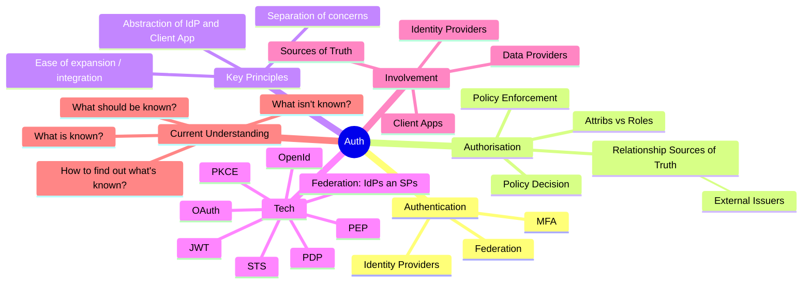
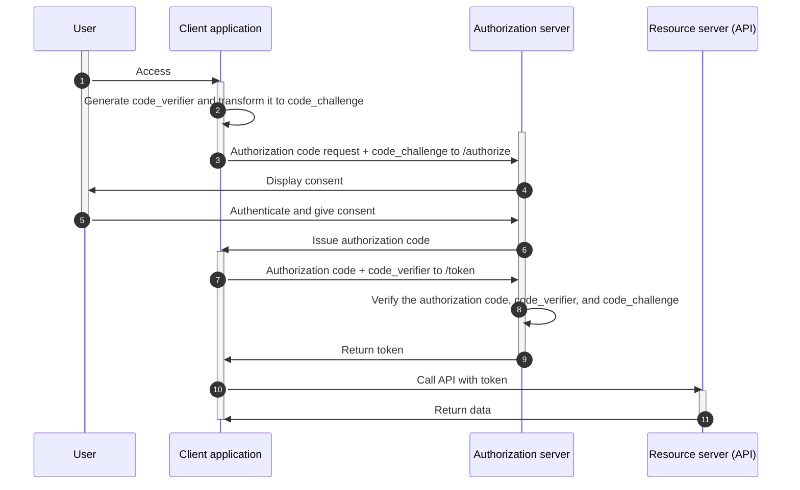
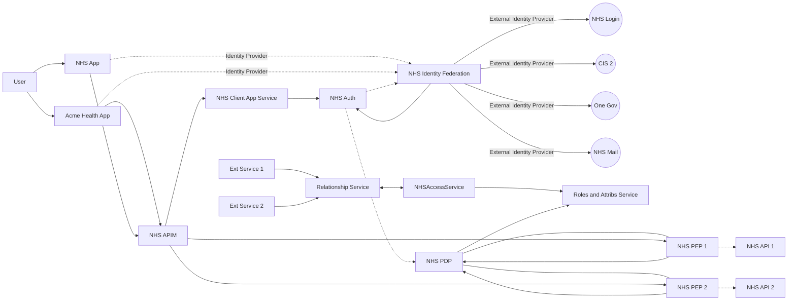
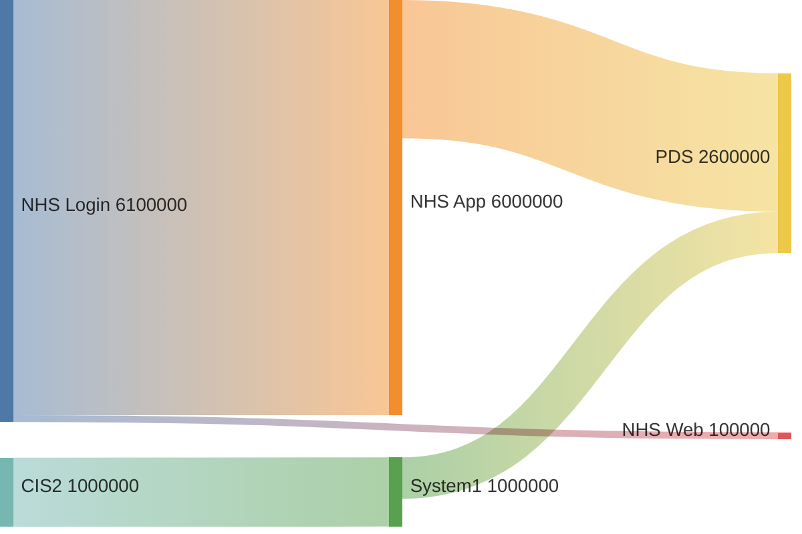

<details open markdown="block">
  <summary>
    Table of contents
  </summary>
  {: .text-delta }
1. TOC
{:toc}
</details>




## Notes for Author - Aims / Objectives / Direction / Plan

- Making Auth accessible to wider audience
- Deep dive sections 
- Also appeal to those with tech background
- Include a case study - how could / should be done
- Need simple diagrams / images
- Need simple example scenarios
- Need a short summary version, and then a longer version with much more detail

### Need to ensure
- Scope of doc is clear
- Ensure there are constraints around use cases

### Objectives

- Provide non tech staff with a understanding 
- Provide details for tech staff to find interesting and to enhance existing knowledge
- Outline architectural design for a NHS Scenario, how to best use tech? "Proxy?"
- Use dev background, provide working code examples and deployments of how this fits together is "best case" scenario

### Questions to answer

- What / where are the main confusions around Auth?
- What is currently done well? What is not done well?
- What is the benefit of doing differently to now?
- How can different be achieved?
- Do we need input / feedback / questionnaire / user research around what people currently understand about Auth?


## Summary

Authentication, Authorisation, OAuth, OpenId, Providers, Verification, Enforcement, Decisions, Credentials, Identity, Access Management, Claims, JWT, Grants, Flows, Bearer, Tokens, Scopes, Policies, Roles, Attributes - the list could go on. Auth is hard. It is hard at times for people with a technical background, developers, engineers and architects. It's just as hard for project managers, business analysts and product teams. 

The aim of this paper is to remove some of the magic and mystery that surrounds Auth, hoping to allow a winder audience to have a better understanding of common Auth terms and processes.

It will then take a look at how NHS could utilise these best practises and follow set Enterprise Architect standards to achieve better outcomes for citizens and staff.

### Mind map thinking



## Introduction

People today have an identity crisis. They may not know it, but most will feel it in their every day interactions with technology. So many usernames, passwords and accounts. Social logins, work logins, government logins. Some web pages and app allow you to chose which existing user account you would like to use, some enforce this as the only option. Each time you enter a password, you are using an identity provider, that has a specific and unique representation of your identity. For some of these you will have completed additional "Biometric" identity verification, some will have Multifactor authentication. Many people turn to password managers just to keep track of what credentials they use for which services.

to cover:

- sso
- better than used to be
- what is the "Nirvana" state for identity? Some would say 1 identity to rule them all.. 


## Getting Started

Objectives

- What is auth
- What should it do
- What are key components
- Key terminology? 


# Deeper Tech Sections


### Auth - Authentication? Authorisation? OAuth? OhhhhhAuth😣...

What do we mean when we just say Auth? What do other people mean what they say just Auth?


Also, to clear up:

- OAuth - This is about **Auth**orisation
- OIDC - OpenId Connect - This adds on top of OAuth, providing Authentication support from Identity Providers. (more on this later.)

<iframe width="560" height="315" src="https://www.youtube.com/embed/t18YB3xDfXI" title="YouTube video player" frameborder="0" allow="accelerometer; autoplay; clipboard-write; encrypted-media; gyroscope; picture-in-picture; web-share" allowfullscreen></iframe>

[An Illustrated Guide to OAuth and OpenID Connect](https://www.youtube.com/watch?v=t18YB3xDfXI)

## Authentication

### What is an Identity Provider (IdP) should an Identity Provider be doing?

> *An IdP is a federation partner, organization, or business responsible for managing a user's digital identity and provides identity authentication and verification services, also known as identity as a service (IDaaS). It can manage and verify various identity information, such as usernames, passwords, or biometric information, to vouch for the identity of a user to a relying application or SP.*
>
> https://www.pingidentity.com/en/resources/identity-fundamentals/identity-and-access-management/identity-providers-service-providers.html#:~:text=The%20role%20of%20the%20SP,application%20session%20for%20the%20user.


### Identity Providers and Service Providers

> *Identity federation standards identify two operational roles in the identity and access management (IAM) and federated networks: the identity provider (IdP) and the service provider (SP). The IdP authenticates the user and provides the SP with the identity information that it requires to grant access to the services and resources that the user needs to do their job.*
>
>  *Identity federation allows both providers to define a trust relationship where the SP provides access to resources using identity information provided by the IdP.*
>
> https://www.pingidentity.com/en/resources/identity-fundamentals/identity-and-access-management/identity-providers-service-providers.html#:~:text=The%20role%20of%20the%20SP,application%20session%20for%20the%20user.

## Authorisation

#### Authorization Code Flow With Proof Key of Code Exchange (PKCE)


Understanding PKCE flow [^auth-flow-pkce]

## How this could look



Changing arrows, set number to be the link to change. e.g.
```
linkStyle 7 stroke:none
linkStyle 10 stroke:none

```


## Key Technologies and Processes

### OAuth

https://developer.okta.com/blog/2019/10/21/illustrated-guide-to-oauth-and-oidc


### Tokens

#### Id Token

#### Access Token

>  *The access token is a piece of code used for authenticating the client application to access specific resources on  the resource owner’s behalf. The access token represents the client’s authorization to access a specific resource.* 
>  *Access tokens can be provided as JSON Web Tokens (JWTs) or opaque tokens, which are passed over HTTPS so that they are secure in transit. *
> 
> ***Access Token Usage***
> 
> *The access token is used by the client application for making API calls to access specific resources on behalf of  their owner. Which particular resource the client can access is determined by scopes included in the token payload. A token with relevant scopes attached allows the client to access a specific resources and/or perform particular actions.*
>
> https://cloudentity.com/developers/basics/tokens/access-token/


Best Practises:

- Keep the signing key secret and reveal it only to services that require it.
- Exclude sensitive data from the payload: Tokens are signed but can be decoded.
- Use as few claims as possible: In the payload, add required claims only to optimize performance and security.

https://cloudentity.com/developers/basics/tokens/access-token/


Example of what can be in an access token

https://learn.microsoft.com/en-us/azure/active-directory/develop/access-token-claims-reference


#### Refresh Token

### OpenId (Connect) (OIDC)

> **ID TOKEN  **
> 
> FOR THE CLIENT. FOR THE CLIENT. FOR THE CLIENT.

OpenID Connect (OIDC) extends the OAuth 2.0 authorization protocol for use as an additional authentication protocol. You can use OIDC to enable single sign-on (SSO) between your OAuth-enabled applications by using a security token called an ID token.

The full specification for OIDC is available on the OpenID Foundation's website at OpenID Connect Core 1.0 specification.

The ID token is a security token that includes claims regarding the authentication of the user by the authorization server with the use of an OAuth client application. The ID token may also include other requested claims. It is created on the authorization server’s side to encode the user’s authentication information. Unlike access tokens **intended to be consumed by the resource server**, ID tokens are intended to be **consumed by the third-party application**.

ID tokens are for storing user data and delivering it to the client application. Since the client application receives the ID token only after the user gets authenticated, the ID token becomes a proof of the **user’s identity to the client.**

### Policy Decision and Enforcement

### Claims, Roles, Attributes

## Identity Federation - Service Provider

> *An SP is a federation partner, organization, or business that offers individuals or enterprises access to application resources, such as software as a service (SaaS) applications, for work-related or personal purposes. Some federation protocols use different terms for the service provider role, such as relying party (RP) or consumer.*
>
> *The role of the SP is to consume the trusted authentication token assertion sent by the IdP. SPs don't authenticate users, and they rely on the IdP to verify the identity of a user. After the SP receives the token, it checks for the verified user information and then creates an application session for the user.*
>
> *The SP offers a service for an enterprise or individual wanting to simplify client access to its services and resources, freeing the organization from the responsibility of providing access to these services.*
>
> https://www.pingidentity.com/en/resources/identity-fundamentals/identity-and-access-management/identity-providers-service-providers.html#:~:text=The%20role%20of%20the%20SP,application%20session%20for%20the%20user.

### Claim Transformations


## How can this be implemented successfully?


### Testing a Sankey Diagram





# Example and Utilising Best Practices

TODO


## References

[^auth-flow-pkce]:Authorization Code Flow With Proof Key of Code Exchange (PKCE)

    - Reference: [Authorization Code Flow With Proof Key of Code Exchange (PKCE)][auth-flow-pkce-url]
    - Type: Website
    - Last Checked: 15/08/2023


[auth-flow-pkce-url]:https://cloudentity.com/developers/basics/oauth-grant-types/authorization-code-with-pkce/ "Authorization Code Flow With Proof Key of Code Exchange (PKCE)"