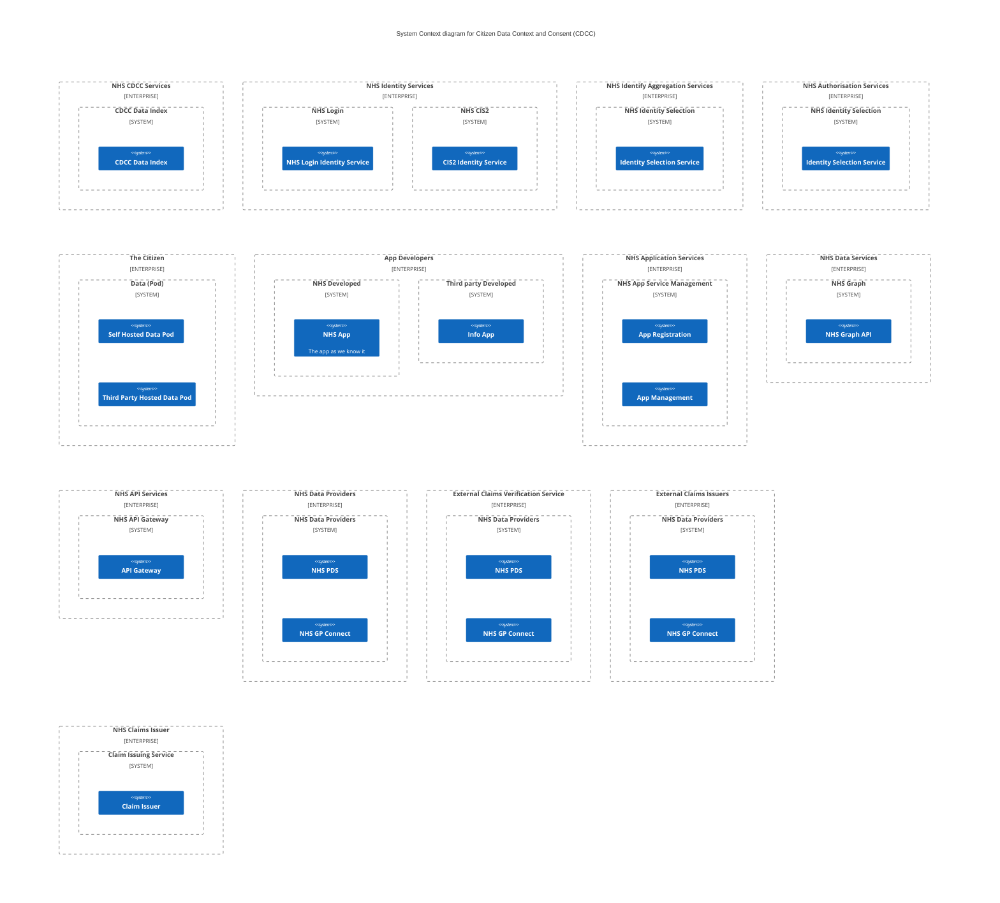



```mermaid
C4Context
title System Context diagram for Citizen Data Context and Consent (CDCC)

UpdateLayoutConfig(4, 4);
Person(citizenContext, "Citizen", "The Citizen / Customer / Patient.")


Enterprise_Boundary(bdfg1, "NHS CDCC Services") {

  System_Boundary(bdfg2, "CDCC Data Index") {
    System(SysdfgtemA, "CDCC Data Index")
  }

}


Enterprise_Boundary(b1, "NHS Identity Services") {

  System_Boundary(b2, "NHS Login") {
    System(SystemA, "NHS Login Identity Service")
  }

    System_Boundary(basd2, "NHS CIS2") {
    System(SysteasdasdmA, "CIS2 Identity Service")
  }


}

Enterprise_Boundary(ddfgfgb1, "NHS Identify Aggregation  Services") {

  System_Boundary(dfgfdfgb2, "NHS Identity Selection") {
    System(SystegfddmA, "Identity Selection Service")
  }
}


Enterprise_Boundary(ddfdfggfgb1, "NHS Authorisation Services") {

  System_Boundary(dfgfdfgdfgb2, "NHS Identity Selection") {
    System(SystegfdfgddmA, "Identity Selection Service")
  }

}

Enterprise_Boundary(bsdfsfd12, "The Citizen") {

  System_Boundary(bsdf22, "Data (Pod)") {
    System(Systsdfem2A, "Self Hosted Data Pod")
    System(Syssdftem2B, "Third Party Hosted Data Pod")
  }

}

Enterprise_Boundary(bsdfsfsdfd12, "App Developers") {

  System_Boundary(bsdsdff22, "NHS Developed") {
   System(SystemAA, "NHS App", "The app as we know it")
  }

  System_Boundary(nhsdfsdisdfrectory2, "Third party Developed") {
    System(nhssdfisfdnfo2, "Info App")
  }
}

Enterprise_Boundary(b13453452, "NHS Application Services") {

  System_Boundary(345b22, "NHS App Service Management") {
    System(Sys4345tem2A, "App Registration")
    System(Syste34367m2B, "App Management")
  }

}

Enterprise_Boundary(b12, "NHS Data Services") {

  System_Boundary(b22, "NHS Graph") {
    System(System2A, "NHS Graph API")
  }
}


Enterprise_Boundary(b1sdfsdf2, "NHS API Services") {

  System_Boundary(bsdfsdf22, "NHS API Gateway") {
    System(Systesdfsdfm2A, "API Gateway")
  }

}


Enterprise_Boundary(b1ssdfsdfdfsdf2, "NHS Data Providers") {

  System_Boundary(bsdfsdfsfdsdf22, "NHS Data Providers") {
    System(Systesdfsfdsfdsdfm2A, "NHS PDS")
    System(Systesdsdfsfdfsdfm2B, "NHS GP Connect")
  }
}

Enterprise_Boundary(b1ssdasdasdfsdfdfsdf2, "External Claims Verification Service") {

  System_Boundary(bsdfsdfasdasdsfdsdf22, "NHS Data Providers") {
    System(Systesdfsfdsfdasdasdsdfm2A, "NHS PDS")
    System(Systesdsdfsfdfasdasdsdfm2B, "NHS GP Connect")
  }
}


Enterprise_Boundary(b1ssdasdasdfsdfsdfdfsdf2, "External Claims Issuers") {

  System_Boundary(bsdfsdfasdasdsdfsfdsdf22, "NHS Data Providers") {
    System(Systesdfsfdsfdasdassdfdsdfm2A, "NHS PDS")
    System(Systesdsdfsfdfasdasdfsdsdfm2B, "NHS GP Connect")
  }
}

Enterprise_Boundary(b1ssdasdasdfsddfgfsdfdfsdf2, "NHS Claims Issuer") {

  System_Boundary(bsdfsdfasdasdsdfsdfgfdsdf22, "Claim Issuing Service") {
    System(Systesdfsfdsfdasdassdfdfgdsdfm2A, "Claim Issuer")
  }
}
```

# Preface

- Identity
- Access Control
- Claims based Access Control
- Relationships
- "Proxy"
- PODs / Data Store
- Digital Verifiable Credentials
- API / Scopes 
- OAuth 2